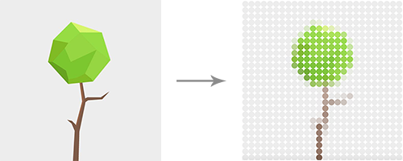

# Photomosaic
A JavaScript plugin that creates a photomosaic of an image.



### Run demo
`npm install`

`npm start`

Open **http://localhost:3000**

### Usage
``` html
<script src="path/to/photomosaic.js"></script>
```

``` javascript
var photomosaic = new Photomosaic(options);
```

### Options
| Option        | Default Value              | Description                                      |
| ------------- | -------------------------- | ------------------------------------------------ |
| image         | null                       | [Mandatory] Image element                        |
| canvas        | null                       | [Mandatory] Target canvas element                |
| width         | null                       | Width of the resulting image                     |
| height        | null                       | Height of the resulting image                    |
| tileWidth     | 15                         | Width of the tile (px)                           |
| tileHeight    | 15                         | Height of the tile (px)                          |
| tileShape     | 'circle'                   | Shape of the tiles (**circle** or **rectangle**) |
| background    | 'rgba(0,0,0,0)'            | Background for transparent images                |

### Methods
| Method               | Description                                   |
| -------------------- | --------------------------------------------- |
| setOptions(options)  | Setting the options                           |
| render()             | Renders mosaic into the canvas                |
| getSize()            | Returns current size of the canvas            |
| getImageData()       | Returns Uint8ClampedArray with raw image data |

### Example
```javascript
var photomosaic = new Photomosaic({
  image: imageNode,
  canvas: canvasNode,
  tileHeight: 10,
  tileWidth: 10,
});

photomosaic.setOptions({
  tileHeight: 20,
  tileWidth: 20,
});

photomosaic.render();
```